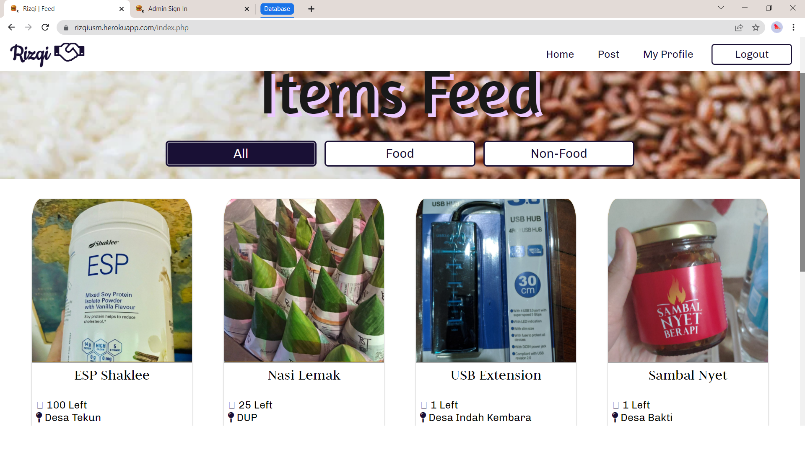
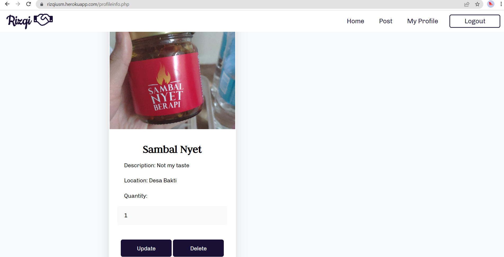
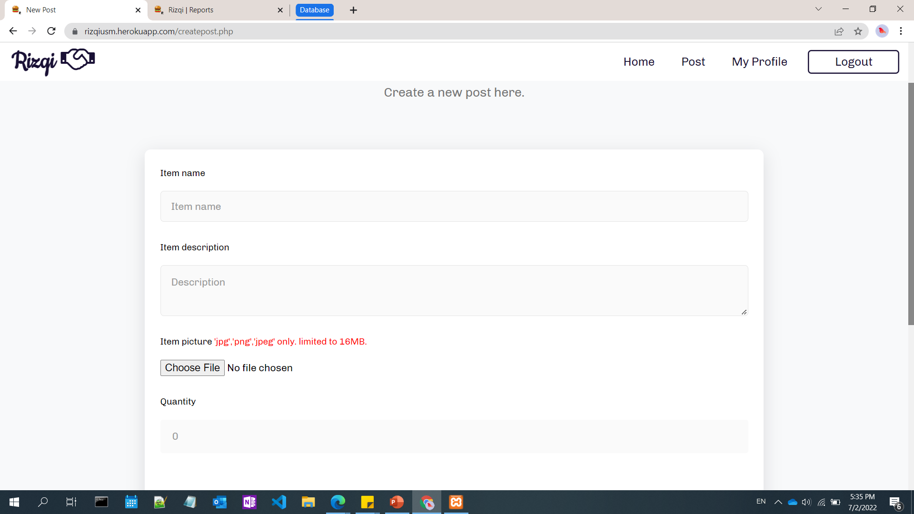
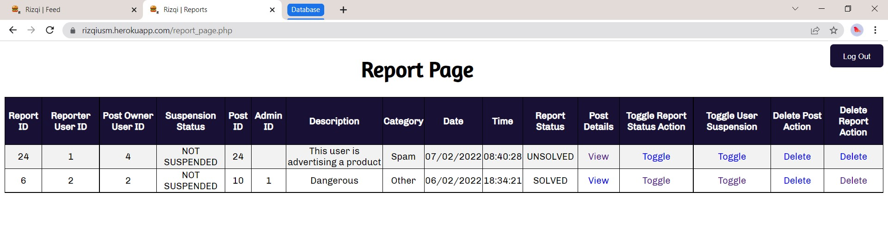

# Rizqi-SDGs-Solution
URL: https://rizqiusm.herokuapp.com/

“Rizqi” is a Web App for the USM community that plays an important role in collecting and distributing surplus food and non-food for the needy, provided that the food that is going to be distributed is still edible. This could be food that’s nearing its sell-by date in mini marts, meals from cafeterias, redundant food from events, groceries that people do not need or secondhand items. Even though this application is on a small scale and is designed only for USM, it would still help reduce the waste generated in Malaysia. The main goal of this system is to ensure every single USMians has enough food to eat and reduce the waste of surplus food and non-food as Malaysia does not have a proper food waste management system.

Main features
1. View Post 2. Create Post 3. Filter Post 4. Edit Post 5. Delete Post 6. Make Report 7. Contact Giver 8. Delete Report 9. Delete User's Post 10. View User's Report 11. Suspend User's Account 12. Update Report's Status

## Normal User Interface
Credentials for testing  
> aliff@student.usm.my
> 7BnA3K*j

#### Giver can update the quantity of item posted.

#### Giver can create post for the items to be given away.

## Admin Interface
https://rizqiusm.herokuapp.com/admin_login_form.php  
Credentials for testing
> admin1
> abc12345

Theme color
> Dark purple #191035 , white #FFFFFF, grey #f8f9fa

Developed by:

> Front-end : Aqilah Syahirah, Siti Sakinah  
> Back-end : Aliff Iskandar, Sin Yee
